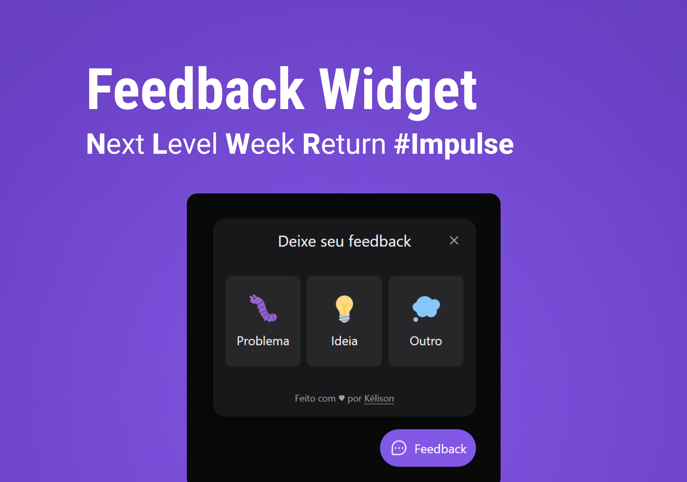

<p align="center">
  <a href="#-projeto">Projeto</a>&nbsp;&nbsp;&nbsp;|&nbsp;&nbsp;&nbsp;
  <a href="#-tecnologias">Tecnologias</a>&nbsp;&nbsp;&nbsp;|&nbsp;&nbsp;&nbsp;  
  <a href="#-layout">Layout</a>&nbsp;&nbsp;&nbsp;|&nbsp;&nbsp;&nbsp;  
  <a href="#-rodar-aplicação">Rodar aplicação</a>&nbsp;&nbsp;&nbsp;|&nbsp;&nbsp;&nbsp;
</p>

<br>

<p align="center">
  
</p>

### 💻 Projeto

Mais um projeto sensacional da [Rocketseat](https://rocketseat.com.br/) executado durante a semana <b>NLW RETURN - TRILHA IMPULSE.</b>

<b>Feedback Widget</b> - Uma aplicação para envio de feedbacks e reports de erros em uma página, com a possibilidade de enviar um comentário e um print da tela atual com apenas um clique.

[Clique aqui para visualizar o projeto](https://nlw-return-impulse-two.vercel.app/)

### 🚀 Tecnologias

Esse projeto foi desenvolvido com as seguintes tecnologias:

- Frontend: [Vite](https://vitejs.dev/) + [React](https://pt-br.reactjs.org/) + [Tailwind](https://tailwindcss.com/)
- Mobile: [React Native](https://reactnative.dev/) + [Expo](https://docs.expo.dev/get-started/installation/)
- Backend: [Node](https://nodejs.org/en/) + [Prisma](https://www.prisma.io/) + [Jest](https://jestjs.io/pt-BR/)

Utilitários:

- Deploy Backend: [Railway](https://railway.app/)
- Deploy Frontend: [Vercel](https://vercel.com/)
- Envio de e-mail: [Mailtrap](https://mailtrap.io/)


### 🔖 Layout

Você pode visualizar o layout do projeto através [desse link](https://www.figma.com/community/file/1009807319507822993/Origin-Six). É necessário ter conta no [Figma](https://figma.com) para acessá-lo.


### 🎮 Rodar aplicação

```bash

# Clone este repositório

# Acesse as pastas do projeto
/web
/mobile
/server

# Instale as dependências
npm install

# Execute aplicação
frontend e backend: npm run dev
mobile: expo start

# Executar testes do backend
na pasta server, rodar npm run test

```